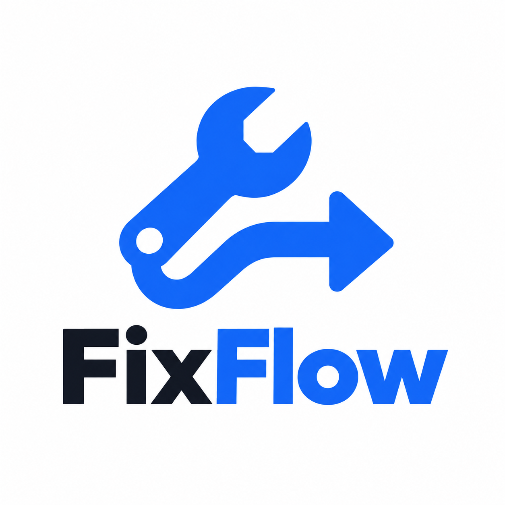

<p align="center">
  
</p>

# FixFlow CMMS

> Open-source Computerized Maintenance Management System — self-hostable, IoT-ready, built for the teams that enterprise software forgot.

**v0.1** · Rails 8 API · React 18 PWA · PostgreSQL · Redis

## Tech Stack

| Layer | Technology |
|---|---|
| **API** | Ruby on Rails 8 (API mode) |
| **Frontend** | React 18 + TypeScript + Vite + Tailwind CSS |
| **Database** | PostgreSQL 16 |
| **Cache / Jobs** | Redis 7 + Sidekiq |
| **File Storage** | MinIO (S3-compatible) |
| **Auth** | Devise + devise-jwt (Bearer JWT) |
| **State** | TanStack Query v5 + Zustand v5 |
| **IoT** | REST webhook + MQTT ingestion |

---

## Quick Start (Docker — recommended)

```bash
git clone https://github.com/GetFixFlow/fixflow.git
cd fixflow
cp .env.example .env
# Edit .env — set RAILS_MASTER_KEY and DEVISE_JWT_SECRET_KEY at minimum
docker compose up -d
docker compose exec api bundle exec rails db:create db:migrate db:seed
```

The API will be available at `http://localhost:3000`.
MinIO console: `http://localhost:9001` (user: minioadmin / minioadmin)

---

## Local Development (without Docker)

### Prerequisites
- Ruby 3.3+
- Node.js 20+
- PostgreSQL 16
- Redis 7
- Bundler 2.5+

### API (Rails)

```bash
git clone https://github.com/GetFixFlow/fixflow.git
cd fixflow
bundle install
cp .env.example .env
# Edit .env with your local Postgres/Redis credentials

bundle exec rails db:create db:migrate
bundle exec rails db:seed     # optional: seeds demo data

bundle exec rails server      # API on :3000
bundle exec sidekiq           # Background workers
```

### Frontend (React)

```bash
cd apps/web
npm install --legacy-peer-deps
cp .env.example .env.local
# Set VITE_API_URL=http://localhost:3000/api/v1

npm run dev     # Dev server on :3001
```

### Frontend Environment Variables

| Variable | Default | Description |
|---|---|---|
| `VITE_API_URL` | `http://localhost:3000/api/v1` | Rails API base URL |
| `VITE_WS_URL` | `ws://localhost:3000/cable` | ActionCable WebSocket URL |
| `VITE_APP_ENV` | `development` | Application environment |

---

## Environment Variables

| Variable | Required | Description |
|---|---|---|
| `RAILS_MASTER_KEY` | Yes | From `config/master.key` |
| `DEVISE_JWT_SECRET_KEY` | Yes | Random 64-char hex string |
| `DATABASE_URL` | Docker only | Full PostgreSQL URL |
| `DB_HOST / DB_USERNAME / DB_PASSWORD` | Local | PostgreSQL connection |
| `REDIS_URL` | Yes | Redis connection URL |
| `IOT_API_KEY` | Yes | API key for IoT sensor ingestion |
| `CORS_ORIGINS` | Yes | Comma-separated allowed origins |
| `MINIO_ENDPOINT` | Yes | MinIO/S3 endpoint |
| `MINIO_ACCESS_KEY_ID` | Yes | MinIO access key |
| `MINIO_SECRET_ACCESS_KEY` | Yes | MinIO secret key |

Generate secrets:
```bash
# DEVISE_JWT_SECRET_KEY
ruby -e "require 'securerandom'; puts SecureRandom.hex(64)"

# IOT_API_KEY
ruby -e "require 'securerandom'; puts SecureRandom.hex(32)"
```

---

## API Overview

All endpoints are under `/api/v1/`. Authentication uses JWT Bearer tokens.

### Auth
| Method | Path | Description |
|---|---|---|
| POST | `/api/v1/auth/login` | Login — returns JWT in `Authorization` header |
| DELETE | `/api/v1/auth/logout` | Logout — revokes JWT |
| POST | `/api/v1/auth/signup` | Create user (admin only) |

### Core Resources
| Resource | Endpoint |
|---|---|
| Health | `GET /api/v1/health` |
| Assets | `/api/v1/assets` |
| Work Orders | `/api/v1/work_orders` |
| PM Schedules | `/api/v1/pm_schedules` |
| Locations | `/api/v1/locations` |
| Parts | `/api/v1/parts` |
| IoT Rules | `/api/v1/iot_rules` |
| Users | `/api/v1/users` |

### IoT Ingestion (no JWT, uses API key)
```bash
POST /api/v1/iot/ingest
Headers: X-API-Key: <IOT_API_KEY>
Body: {
  "asset_id": 1,
  "readings": { "temperature": 72.4, "vibration": 3.2 },
  "timestamp": "2026-05-03T10:00:00Z"
}
```

### MQTT
Devices publish to: `fixflow/assets/{asset_id}/telemetry`
Payload: `{ "temperature": 72.4, "vibration": 3.2, "timestamp": "..." }`

---

## Work Order Status Flow

```
open → in_progress → pending_parts → in_progress
                  |
                  v
              completed → verified
```

---

## Architecture

```
IoT Devices ──MQTT/REST──► FixFlow API (Rails 8)
                                  |
                    +─────────────+─────────────+
                    |             |             |
              PostgreSQL       Redis          MinIO
             (core data)    (Sidekiq)    (file storage)
```

**Stack:**
- **API**: Ruby on Rails 8, API mode
- **Auth**: Devise + devise-jwt (Bearer JWT)
- **Jobs**: Sidekiq + Redis
- **Storage**: ActiveStorage → MinIO (S3-compatible)
- **IoT**: REST webhook + MQTT-compatible ingestion
- **Serialization**: Blueprinter
- **Pagination**: Pagy

---

## Running Tests

### API (RSpec)

```bash
bundle exec rspec
bundle exec rspec spec/requests/   # request specs only
bundle exec rspec spec/models/     # model specs only
```

### Frontend (Vitest)

```bash
cd apps/web
npm run test          # run all tests
npm run test:ui       # Vitest UI
npm run test:coverage # coverage report
```

---

## Roles and Permissions

| Action | Admin | Manager | Technician | Requester |
|---|---|---|---|---|
| Create users | Yes | No | No | No |
| Manage PM schedules | Yes | Yes | No | No |
| Assign work orders | Yes | Yes | No | No |
| Update work orders | Yes | Yes | Yes (own) | No |
| Submit work requests | Yes | Yes | Yes | Yes |
| View assets | Yes | Yes | Yes | No |

---

## Development Roadmap

- **v0.1** (current) — Core CMMS loop: assets, work orders, PM, IoT ingestion
- **v0.2** — Anomaly detection, auto-prioritization
- **v0.3** — Predictive maintenance (RUL estimation)
- **v0.4** — Natural language work order creation

---

## License

AGPLv3 — see [LICENSE](LICENSE).
